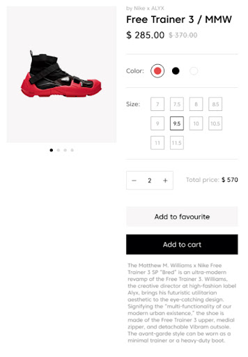
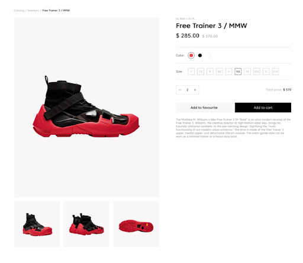

<h1 align="center">PruebaGradiwebFront-End</h1>

## Objetivo

* Solicitar información a un API pública
* Realizar la maquetación de una ficha de producto (en base a los datos obtenidos en el API), la cual contiene información básica como:
Nombre
Precio real
Precio más alto (%)
Descripción
Galería de imágenes
Variantes de producto (S / M / L) y su respectivo precio
* Realizar un carrusel animado con las imágenes del producto
* Adaptar resultado a las diferentes versiones/tamaños de pantalla (Diseño Responsivo)
* Agregar un formulario que nos permita seleccionar una variante del producto
* Añadir funcionalidad a la acción de <añadir al carrito> mediante un botón. Esta acción/evento debe desplegar un mensaje con título y variante seleccionada.

## Requisitos y condiciones 💯
* Maquetar una aplicación web que permita suplir las necesidades del objetivo.
* Como mínimo la aplicación debe estar escrita en HTML, CSS y JavaScript.
* Se proporcionan mockups guía de la aplicación requerida y con este se puede proceder al desarrollo del prototipo de alta fidelidad.
* No se proporciona boceto del modal/pop-up accionado por evento <añadir al carrito> pero este debe adaptarse al lenguaje gráfico proporcionado en el prototipo (mockup).
* Se valorará el uso de buenas prácticas de programación, orden, creatividad, experiencia de usuario y documentación del trabajo.
* Puede utilizar únicamente tecnologías como (Vanilla JS, ReactJS, VueJS, SASS, CSS3, HTML5, SASS), el uso de jQuery no será válido para la prueba.
* Crear un repositorio público, en el cual evidencie buenas prácticas con un sistema de versiones y el código fuente del producto final. Debe poder instalarse y ejecutarse de forma fácil en un entorno de desarrollo local. *Incluir en la documentación.
* La prueba debe desarrollarse en un tiempo no mayor a cuatro (4) horas.
* La información básica del producto deberá solicitarla al siguiente endpoint:
https://graditest-store.myshopify.com/products/free-trainer-3-mmw.js
* La documentación sobre cómo usar el API de Shopify la encuentras [aquí](https://shopify.dev/api/ajax/reference/product#get-products-product-handle-js)

## Mockups





 ## Table of Content
* [Installation](#installation)
* [Documentation](#documentation)
* [Descriptions](#descriptions)
* [Authors](#authors)
* [Acknowledgment](#Acknowledgment)


## Installation

Update your local package index by first typing the following:

   - ``` $sudo apt-get update```	

Install node.js and npm

   - ``` $sudo apt-get install nodejs```

   - ```	$sudo apt-get install npm```

 Go to the project folder and run the following command to install the dependencies:

- ```$cd PruebaGradiwebFront-End```
- ```$npm install```	

the program will run with the following command:
- ```$npm start```

Now you can see gradiwebshopping in the browser.

    Local: http://localhost:3000

Note that the development build is not optimized.
To create a production build, use npm run build.

## Documentation 

- [Nodejs](http://nodejs.org/es/ "Nodejs")
- [Npm](https://www.npmjs.com/ "Npm")
- [React](https://reactjs.org/ "React")


## Descriptions

[BodyRender](/gradiwebshopping/src/component/body/index.js)

BodyRender is one of the main components of the
application, since it shows all the information
of the page and its products

[HeaderRender](/gradiwebshopping/src/component/header/index.js)

HeaderRender displays the page title

[ImagesRender](/gradiwebshopping/src/component/images/index.js)

ImagesRender creates a carousel of photos
that presents the images that the API contains,
they are rendered by this component to show them
in an organized and simple way in each of the
responsive states

[Modal](/gradiwebshopping/src/component/modal/index.js)

Modal component that displays the add to cart and add to favorites popups

[Modals](/gradiwebshopping/src/component/modals/modals.js)

Modals is the intermediary between Modal
and BodyRender, with which the add to cart
and add to favorites buttons are rendered.

[descriptionSelect](/gradiwebshopping/src/functions/descriptionSelect.js)

Cleans the product description of dead or abandoned code residue

[productsUrl](/gradiwebshopping/src/functions/global.js)

URL transport function.

[widthSelectFunct](/gradiwebshopping/src/functions/widthSelect.js)

widthSelectFunct is a function that retrieves the product colors from the API.

[widthSelectFunct2](/gradiwebshopping/src/functions/widthSelect2.js)

widthSelectFunct2 is a function that retrieves the product sizes from the API.

[useModal](/gradiwebshopping/src/hooks/useModal.js)

useModal Funct is a function that displays the add to cart and add to favorites popups. Makes use-states for handling modals With this function open and close the popup.

[App](/gradiwebshopping/src/App.js)

Main element that renders the entire app.


## Authors
- [Didier Revelo](http://github.com/didierrevelo "Didier Revelo")
- [Didier Revelo LinkedIn](https://www.linkedin.com/in/didierrevelo/ "LinkedIn")
- [Didier Revelo website](https://didierrevelo.github.io/ "Didier Revelo website")


## Acknowledgment
 
 -  [GradiWeb]( https://www.gradiweb.com/fr/ "GradiWeb")